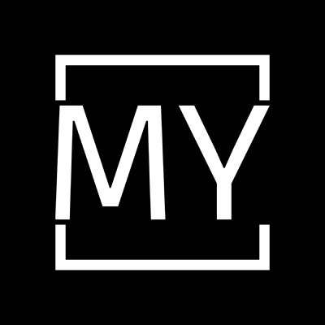

# Интернет-магазин одежды

Это проект студентов 3 курса КФУ: Хисаметдинова Данира, Яруллиной Эльвины, Хайбуллины Светланы.


Проект будет посвящен интернет-магазину одежду с названием "My"(это ТОЧНО не отсылка на всем известный магазин)

Наш логотип:



## Языки и инструментарий 
<div>


</div>

## Установка и запуск проекта

### Устанавливаем зависимости

```shell
npm install
```

### Запуск

```shell
npm start
```

## MVP 1 и описание функционала страницы
**1. Главная страница** *(Яруллина Эльвина)*
  - Товары, их стоимость, названия
  * Поиск по названию
  + "Hero section" - секция с информацией о скидках, новых коллекциях. 

**2. Детальная информация о товаре** *(Хисаметдинов Данир)*
  - Товары из той же коллекции
  * Возможность поменять цвет товара
  + Более детальная информация(размерная сетка, цвета, описание, стоимость)

**3. Бронирования** *(Светлана Хайбуллина)*
  * Окно бронирования (введение пользователем личных данных)
  - Информация о заказанных товарах 
  + Возможность редактировать заказ (увеличивать количество)

  ## Полезные ссылки
  [Figma](https://www.figma.com/file/bQlOsqJWrmQSWh2guDZyGH/Untitled?type=design&node-id=0%3A1&mode=design&t=yS3fdAWJrg3sOYOJ-1)


